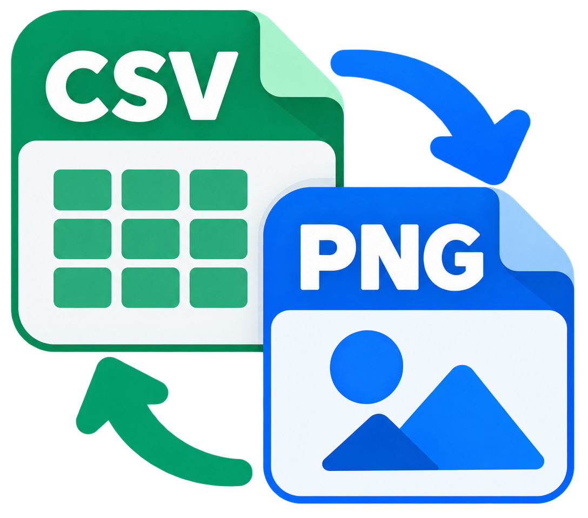

<p align="center">
  
</p>

# csv2png

**Turn CSV files into PNG images and restore them byte for byte.**

csv2png is a Windows utility that stores CSV data directly in the RGB pixels of a
PNG.

## Features

- **Lossless round trips:** restore the exact original CSV bytes.
- **Standard PNG output:** store data as RGB pixels with DEFLATE compression.
- **Command line or file picker:** pass a file path or launch without arguments.

## Installation

Download `csv2png-v<version>-win_amd64.zip` from
   [GitHub Releases](https://github.com/allachance/csv2png/releases).

## Usage

```text
csv2png [input.csv|input.png] [-o output]
```

| Option | Description |
| --- | --- |
| `-o, --output PATH` | Set the destination file. |
| `-h, --help` | Show command-line help. |
| No arguments | Open the native file picker to select one or more files. |

Use quotes for paths containing spaces:

```powershell
.\csv2png.exe "my data.csv" --output "my data.png"
```

Double-click `csv2png.exe` to open the file picker. The application's own console
is closed automatically, and conversion results or errors appear in a dialog.
A console window may briefly appear during startup. When launched from an
existing terminal, the application keeps its console output and exit status,
including when run without arguments to open the picker.

When using the file picker, use Ctrl-click or Shift-click to select multiple CSV
or csv2png PNG files. Each file is converted separately, with its output saved
beside the input using the opposite extension. Existing files are never
overwritten. If a conversion fails, the remaining files are still processed, and
the application exits with a nonzero status if any conversion failed. Cancelling
the picker exits without converting anything.

Command-line usage still accepts exactly one input file.

## Limits and considerations

| Input | Maximum size |
| --- | --- |
| CSV | 512 MiB |
| PNG | 514 MiB |

- Only PNGs created by csv2png can be restored to CSV; arbitrary images are not
  supported.

## Build from source

### Requirements

Install the following and ensure they are on your `PATH`:

- [Nim](https://nim-lang.org/install.html) 2.2.10 or newer, with Nimble
- [Zig](https://ziglang.org/download/) for C and Windows resource compilation

### Build

From the repository root run:

```powershell
nimble bin
```

The release executable is written to `build/csv2png.exe`.

To build and assemble a distribution folder containing the executable and
license documentation:

```powershell
nimble dist
```

The folder is written to `dist/csv2png-v<version>-win_amd64/`.

## License

Released under the [MIT License](LICENSE).
See [Third-party notices](THIRD-PARTY-NOTICES.md) for dependency licensing details.
